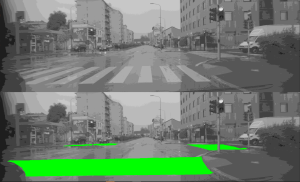
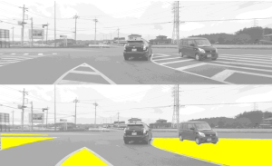
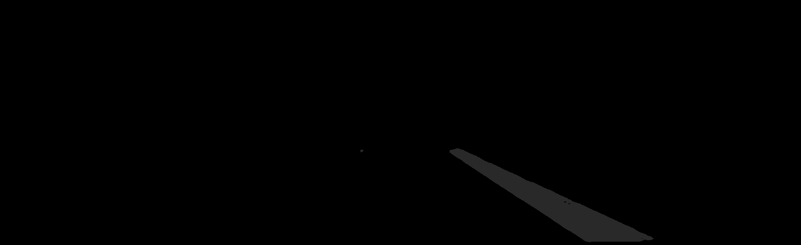

# Semantic Segmentation for Road Markings (Bosch Challenge Winner)


---

🏆 As the **1st Place Winner of the Bosch Students Machine Learning Challenge**, I developed this high-performance semantic segmentation model to identify crosswalks and restricted driving areas. My final solution utilizes a **DeepLabV3+** architecture with a **ResNet-101** backbone, achieving a **Mean Intersection over Union (mIoU) of approximately 88%** on the competition's final test set.

## Model in Action

Here are two examples of the model's predictions on validation images. The model correctly identifies and segments crosswalks (green) and restricted driving areas (yellow).

| Crosswalk Class | Restricted Area Class |
| :---: | :---: |
|  |  |

## Key Features

-   **Winning Architecture**: Implemented the DeepLabV3+ model, choosing it for its effectiveness in capturing fine-grained details through its encoder-decoder structure and Atrous Spatial Pyramid Pooling (ASPP) module.
-   **Strategic Backbone Selection**: After experimenting with several backbones, chosed ResNet-101 for its deep feature extraction capabilities, which proved to be the decisive factor in achieving the winning performance.
-   **Effective Transfer Learning**: Engineered a transfer learning strategy using Cityscapes pre-trained weights. This decision boosted performance by **2-3%** by starting from a model already familiar with a similar, road-based semantic domain.
-   **Custom Data Pipeline**: To handle the unique format of the challenge, a custom PyTorch data loader was built, that parses a `.csv` file and correctly maps the competition's specific label values (e.g., 34, 41) to training-friendly indices (1, 2).

---

## Project Overview

### The Challenge

The objective of the Bosch Students Machine Learning Challenge was to develop a model that could accurately perform semantic segmentation on road scenes. The specific task was to identify two key classes: **crosswalks** and **restricted driving areas**. Performance was evaluated using the Mean Intersection over Union (mIoU) metric.

### Core Strategy

The strategy was centered on using a pre-trained model to manage the constraints of a small dataset and limited GPU resources, avoiding the high cost of training from scratch.

Initializing the ResNet-101 backbone with weights from the Cityscapes dataset provided a competitive edge by leveraging a model already familiar with parsing road scenes. Moreover, the data for the target classes was enlarged by consolidating all other labeled classes into a single "background" class.

The DeepLabV3+ classification head was also customized: the original 19-class layer from the Cityscapes model was replaced by a 3-class layer tailored for this challenge. The final model used an output_stride of 16, configuring the ASPP module with atrous rates of (6, 12, 18).

### Challenges & Learnings

This project was a valuable exercise in achieving high performance under constraints.
* **Overcoming Data Scarcity**: The biggest challenge was the small dataset size. My solution of using a targeted transfer learning approach from Cityscapes instead of the more generic ImageNet was highly effective. It taught me the importance of choosing a pre-trained model from a domain as close as possible to the target problem.
* **Preventing Data Leakage**: The dataset consisted of video sequences. A naive random split would have placed nearly identical, consecutive frames in both the training and validation sets, leading to an artificially inflated validation score. I prevented this by splitting the data based on the source sequence, ensuring the model was validated on truly unseen scenarios.
* **Thoughtful Data Handling**: The raw data was in YUV color space, which I converted to RGB. I also noticed a heavy class imbalance, with many frames containing no relevant markings. To counter this, I sampled only a fraction of the "background-only" images to prevent the model from becoming biased towards predicting nothing.

---

## Setup & Installation

Follow these steps to set up the project environment.

1.  **Clone the repository:**
    ```bash
    git clone https://github.com/MihaiBogdanDeaconu/Semantic-Segmentation-for-Road-Markings.git
    cd Semantic-Segmentation-for-Road-Markings
    ```

2.  **Create a virtual environment (recommended):**
    ```bash
    python -m venv venv
    source venv/bin/activate  # On Windows, use `venv\Scripts\activate`
    ```

3.  **Install the required dependencies:**
    ```bash
    pip install -r requirements.txt
    ```

---

## Dataset Preparation

The model expects a CSV file that points to the image and label files and assigns each pair to a data split (`train` or `eval`).

Create a `data.csv` file with the following columns: `image_path`, `label_path`, `split`.

**Example `data.csv`:**
```csv
image_path,label_path,split
data/set1/images/0001.png,data/set1/labels/0001.png,train
data/set1/images/0002.png,data/set1/labels/0002.png,train
...
data/set2/images/0050.png,data/set2/labels/0050.png,eval
data/set2/images/0051.png,data/set2/labels/0051.png,eval

```
-----

## Usage

The project includes separate scripts for training the model and running predictions.

### Training

To train the model, run `main.py` with the appropriate arguments. The following command replicates the setup for my winning ResNet-101 model.

```bash
python main.py \
    --dataset_csv /path/to/your/data.csv \
    --model deeplabv3plus_resnet101 \
    --pretrained_on cityscapes \
    --batch_size 16 \
    --output_stride 16 \
    --crop_size 768 \
    --lr 0.01 \
    --total_itrs 50000 \
    --gpu_id 0
```

The best performing checkpoint will be saved in the `checkpoints/` directory.

### Prediction

To generate segmentation masks for new images, use the `predict.py` script. The `--output_type label` flag is crucial as it remaps the internal model predictions (0, 1, 2) to the official competition label values (0, 34, 41).

```bash
python predict.py \
    --input /path/to/your/images_or_image.png \
    --output_dir ./predictions \
    --ckpt checkpoints/best_deeplabv3plus_resnet101.pth \
    --model deeplabv3plus_resnet101 \
    --output_stride 16 \
    --output_type label \
    --gpu_id 0
```

The predicted masks will be saved as PNG files in the specified output directory.

-----

## Results & Performance

My experimentation with different backbones and hyperparameters (`output_stride`, `batch_size`, etc.) confirmed that a deeper model was necessary for this task. The final ResNet-101 model significantly outperformed the ligther models.

| Model Backbone  | Dataset       | Best mIoU |
| --------------- | ------------- | :-------: |
| MobileNetV2     | Validation Set|   \~81%    |
| ResNet-50       | Validation Set|   \~80%    |
| ResNet-101      | Validation Set|   \~85%    |
| **ResNet-101** | **Test Set (Final)** |   **\~88%** |

Below is a sample prediction mask generated by the final model for the competition submission. This is a raw, single-channel image where pixel values correspond to class IDs.



### Label Mapping

To simplify training, the model uses simple integer class IDs internally. The `predict.py` script automatically remaps these to the official competition values when generating the final prediction masks.

| Class             | Internal Training ID | Competition Submission Value |
| ----------------- | -------------------- | ---------------------------- |
| Background        | 0                    | 0                            |
| Crosswalk         | 1                    | 34                           |
| Restricted Area   | 2                    | 41                           |

-----

## Future Work

Based on my experiments, several paths could be explored to further improve performance:

  - **Hyperparameter Tuning**: Systematically optimize hyperparameters, especially finding better learning rate schedules.
  - **Contextual Information**: Train on more classes (e.g., cars, sidewalks) to provide the model with better contextual understanding.
  - **Advanced Backbones**: Experiment with more modern backbones like HRNet.
  - **Data Expansion**: Enlarge the training dataset with more diverse road scenes.
  - **Loss Functions & Optimizers**: Investigate the impact of different loss functions and optimizers on performance.

<!-- end list -->
